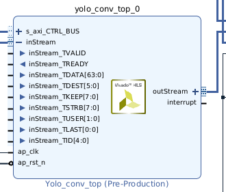
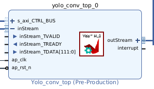

# Tiny YOLO v3 ZYNQ

## [Yu-Zhewen/Tiny_YOLO_v3_ZYNQ](https://github.com/Yu-Zhewen/Tiny_YOLO_v3_ZYNQ)

&darr; part of original README

---

## Navigate inside the project

/code

main codebase including "templates" (managed by the script) and a design example (with bitfile and sdk, ready for deployment on Zedboard)

/data

weights and test data

/document

include the paper (recommend read first) and thesis (more detailed)

/model

code used for analytical models and design space exploration

/scripts

entry point for the automated framework

/tools

some tools used for helping the test, not important

---

## Changes

-   target board : Zybo Z7-20
-   OS : RHEL 8
-   Vivado tool version : 2022.2

**Original vivado tool version was 2019.1 but**<br>
**In 2022.2, there are some changes...**

1. `scripts/run_all.py`

```python
# device = "xc7z020-clg484-1"
device = "xc7z020-clg400-1" # Zybo Z7-20 core
clk_ns = "10"
```

> Change device by Original README

```python
...

# get optimal config
with open("opt.conf", "r") as fp:
    opt_conf = fp.readline().rstrip().split(",")
    conf_cmd = {"N_max" : "#define MAX_KERNEL_NUM " + opt_conf[0] + "\n",
                "P_mem" : "#pragma HLS ARRAY_PARTITION variable=local_mem_group block factor=" + opt_conf[1] + " dim=1\n",
                "P_acc" : "#pragma HLS RESOURCE variable=kernel_bias_fp core=RAM_1P_BRAM" if opt_conf[2] == "1" else "#pragma HLS ARRAY_PARTITION variable=kernel_bias_fp cyclic factor=" + str(int(opt_conf[3])>>1) + " dim=1\n",
                "P_pool" : "#pragma HLS ALLOCATION function instances=window_max_pool limit=" + opt_conf[3] + " \n",
                "P_yolo" : "#pragma HLS ALLOCATION function instances=logistic_activate limit=" + opt_conf[5] + " \n"}
                # "P_pool" : "#pragma HLS ALLOCATION instances=window_max_pool limit=" + opt_conf[3] + " function\n",
                # "P_yolo" : "#pragma HLS ALLOCATION instances=logistic_activate limit=" + opt_conf[5] + " function\n"}
```

> Change some pragma of Vitis HLS. <br>
> [pramga HLS allocation of Vitis HLS User Guide 2022.2](https://docs.amd.com/r/2022.2-English/ug1399-vitis-hls/pragma-HLS-allocation)

```python
...

with open("run_hls.tcl", "w") as tcl_fp:
        tcl_fp.write("set XF_PROJ_ROOT /tools/Xilinx/Vitis_HLS/2022.2/include/vision\n")
        tcl_fp.write("open_project -reset " + hls_prj_name + "_prj\n")
        tcl_fp.write("set_top " + hls_prj_name + "_top\n")

        # for src_file in os.listdir("src"):
        #     tcl_fp.write("add_files src/" + src_file + "\n")
        for src_file in os.listdir("src"):
            if src_file.endswith(".cpp"):
                tcl_fp.write("add_files src/" + src_file + " -cflags -I${XF_PROJ_ROOT}/L1/include\n")
            else:
                tcl_fp.write("add_files src/" + src_file + "\n")        

        # for tb_file in os.listdir("tb"):
        #     tcl_fp.write("add_files -tb tb/" + tb_file + "\n")
        for tb_file in os.listdir("tb"):
            if tb_file.endswith(".cpp"):
                tcl_fp.write("add_files -tb tb/" + tb_file + " -cflags -I${XF_PROJ_ROOT}/L1/include\n")
            else:
                tcl_fp.write("add_files -tb tb/" + tb_file + "\n")

        # tcl_fp.write("open_solution \"solution1\"\n")
        # tcl_fp.write("set_part {" + device + "} -tool vivado\n")
        tcl_fp.write("open_solution \"solution1\" -flow_target vivado\n")
        tcl_fp.write("set_part {" + device + "}\n")
```

> In this project, the HLS codes use a `hls_video.h` header file. This is no longer supported after version 2020.1 [AMD Support](https://adaptivesupport.amd.com/s/article/75345?language=en_US)<br>
> So, we need to Install [*Vitis Libraries*](#vitis-libraries) and add `-cflags` for compile. [Vitis Vision github (example of `run_all.tcl`)](https://github.com/Xilinx/Vitis_Libraries/blob/master/vision/L1/examples/accumulate/run_hls.tcl)<br>
> No more support `-tool` option in Vitis HLS 2022.2 ([maybe from 2020.2 version](https://github.com/Xilinx/PYNQ/issues/1174))

```python
...

    # os.system("vivado_hls run_hls.tcl")
    os.system("vitis_hls run_hls.tcl")
    ip_directory = os.path.join(root_path, "code", "ip")
    if not os.path.exists(ip_directory):
        os.makedirs(ip_directory)    
    shutil.copy(hls_prj_name + "_prj/solution1/impl/ip/xilinx_com_hls_" + hls_prj_name + "_top_1_0.zip", root_path + "/code/ip/xilinx_com_hls_" + hls_prj_name + "_top_1_0.zip")

```

> program name has been changed : `vivado_hls` &rarr; `vitis_hls` <br>
> before copy, need to generate 'ip' folder in code : /code/ip &larr; I just use `mkdir`

---

2. `code/sys/run_all.tcl`

```tcl
...

################################################################
# Check if script is running in correct Vivado version.
################################################################
# set scripts_vivado_version 2019.1
set scripts_vivado_version 2022.2
set current_vivado_version [version -short]

if { [string first $scripts_vivado_version $current_vivado_version] == -1 } {
   puts ""
   catch {common::send_msg_id "BD_TCL-109" "ERROR" "This script was generated using Vivado <$scripts_vivado_version> and is being run in <$current_vivado_version> of Vivado. Please run the script in Vivado <$scripts_vivado_version> then open the design in Vivado <$current_vivado_version>. Upgrade the design by running \"Tools => Report => Report IP Status...\", then run write_bd_tcl to create an updated script."}

   return 1
}
```

> change version check value

```tcl
...

set list_projs [get_projects -quiet]
if { $list_projs eq "" } {
   create_project project_1 myproj -part [lindex $argv 0] -force
   set_property board_part digilentinc.com:zybo-z7-20:part0:1.1 [current_project]
}
```

> add `set_property` since I have board file. [how to install board file](https://velog.io/@tony0613/Vivado-2022.2-%EC%84%A4%EC%B9%98#zybo-z7-20-board-%EC%84%A4%EC%B9%98)

```tcl
...

# file mkdir myproj/project_1.sdk
# file copy -force myproj/project_1.runs/impl_1/design_1_wrapper.sysdef myproj/project_1.sdk/design_1_wrapper.hdf

# launch_sdk -workspace myproj/project_1.sdk -hwspec myproj/project_1.sdk/design_1_wrapper.hdf
start_gui
```

> no longer need `.sdk` folder<br>
> `.hdf` &rarr; `.xsa`<br>
> `launch_sdk` &rarr; `vitis` 

---

#### 3. `code/hls`

before compile hls code, you need to install additional library(vitis vision). [how to install](#vitis-libraries)

- `/yolo_conv/src/yolo_conv.h` ~ `/yolo_upsamp/src/yolo_upsamp.h`

```cpp
#include "yolo_stream.h"
// #include "hls_video.h"
#include "common/xf_common.hpp"
#include "common/xf_utility.hpp"

// typedef hls::Window<KERNEL_DIM,KERNEL_DIM,fp_data_type> window_type;
// typedef hls::LineBuffer<KERNEL_DIM,MAX_IN_WIDTH,fp_data_type> line_buff_type;
typedef xf::cv::Window<KERNEL_DIM,KERNEL_DIM,fp_data_type> window_type;
typedef xf::cv::LineBuffer<KERNEL_DIM,MAX_IN_WIDTH,fp_data_type> line_buff_type;
```

> I'm not sure which header file need to be included.<br>
> 1. `common/xf_utility.hpp`
> 2. `common/xf_video_mem.hpp`

- AXI Stream

There's some problem.

| <b>correct ip block on 2019 ver.</b> | <b>incorrect ip block on 2022 ver.</b> |
|:---:| :---: |
||  |

&darr; [From HLS UG 2022.2](https://docs.amd.com/r/en-US/ug1399-vitis-hls/AXI4-Stream-Interfaces-without-Side-Channels)
> :star: Tip: If you specify an hls::stream object with a data type other than **`ap_axis`** or **`ap_axiu`**, the tool will infer an AXI4-Stream interface **without** the TLAST signal, or any of the side-channel signals. This implementation of the AXI4-Stream interface consumes fewer device resources, but offers no visibility into when the stream is ending.

&darr; Our hls code using user data type...

```cpp
template<int D,int U,int TI,int TD>
  struct ap_axi_fp{
	quad_fp_pack   data;
    ap_uint<(D+7)/8> keep;
    ap_uint<(D+7)/8> strb;
    ap_uint<U>       user;
    ap_uint<1>       last;
    ap_uint<TI>      id;
    ap_uint<TD>      dest;
};

typedef ap_axi_fp<64,2,5,6> quad_fp_side_channel;
typedef hls::stream<quad_fp_side_channel> yolo_quad_stream;
```

> Here is a UG and a github link for how to handle this issue.<br>
> [AXI4-Stream Interfaces with Side-Channels](https://docs.amd.com/r/en-US/ug1399-vitis-hls/AXI4-Stream-Interfaces-with-Side-Channels?tocId=66_J6r2PEhfxupRb0AV3Qg), <br>
> [hls stream example github](https://github.com/Xilinx/Vitis-HLS-Introductory-Examples/tree/master/Interface/Streaming)

- `/yolo_acc/src/yolo_stream.h` ~ `/yolo_yolo/src/yolo_stream.h`

```cpp
#include "ap_axi_sdata.h"

// template<int D,int U,int TI,int TD>
//   struct ap_axi_fp{
// 	quad_fp_pack   data;
//     ap_uint<(D+7)/8> keep;
//     ap_uint<(D+7)/8> strb;
//     ap_uint<U>       user;
//     ap_uint<1>       last;
//     ap_uint<TI>      id;
//     ap_uint<TD>      dest;
// };

// typedef ap_axi_fp<64,2,5,6> quad_fp_side_channel;
typedef hls::axis<quad_fp_pack, 2, 5, 6> quad_fp_side_channel;
typedef hls::stream<quad_fp_side_channel> yolo_quad_stream;
typedef hls::stream<fp_data_type> yolo_inter_stream;
```

> 1. include "ap_axi_sdata.h"
> 2. use hls::axis templete to generate side channel stream

- `/yolo_max_pool/tb/yolo_max_pool_tb.cpp`

```cpp
    if (flag)
            // return 1;
            return 0;
    else
            return 0;
```

> test bench fail<br>
> When you dump trace and check waveform,<br>
> output doesn't sink<br>
> but I didn't find why...
>> ```tcl
>> WARNING: [SIM 212-201] RTL produces unknown value 'x' or 'X' on some port, possible cause: There are uninitialized variables in the design.
>> 173055
>> INFO [HLS SIM]: The maximum depth reached by any hls::stream() instance in the design is 692224
>> ERROR: [COSIM 212-361] C TB post check failed, nonzero return value '1'.
>> ERROR: [COSIM 212-4] *** C/RTL co-simulation finished: FAIL ***
>> ```

4. `sdk/src/yolo_sys.cpp`

```cpp
#include "../include/group_0_weight.h"
#include "../include/group_1_weight.h"
#include "../include/group_2_weight.h"
#include "../include/group_3_weight_it.h"
#include "../include/group_4_weight_it.h"
#include "../include/group_6_weight_it.h"
#include "../include/group_7_weight_it.h"
#include "../include/group_8_weight_it.h"
#include "../include/group_9_weight_it.h"
#include "../include/group_10_weight_it.h"
#include "../include/group_11_weight_it.h"
#include "../include/group_12_weight_it.h"
#include "../include/group_13_weight_it.h"

#include "../include/group_0_input.h"
#include "../include/group_13_output.h"
```

> I don't know how to add `cflags -I../include`

```cpp
void set_yolo_conv(u32 output_ch,u32 input_ch,u32 fold_output_ch,u32 fold_input_ch,
		 	 	   u32 input_h,u32 input_w,u32 real_input_h,
				   u32 fold_win_area)
{
    XYolo_conv_top_Set_output_ch(&yolo_conv_top,output_ch);
    XYolo_conv_top_Set_input_ch(&yolo_conv_top,input_ch);
    XYolo_conv_top_Set_fold_output_ch(&yolo_conv_top,fold_output_ch);
    XYolo_conv_top_Set_fold_input_ch(&yolo_conv_top,fold_input_ch);
    XYolo_conv_top_Set_input_h(&yolo_conv_top,input_h);
    XYolo_conv_top_Set_input_w(&yolo_conv_top,input_w);
    XYolo_conv_top_Set_real_input_h(&yolo_conv_top,real_input_h);
    XYolo_conv_top_Set_fold_win_area(&yolo_conv_top,fold_win_area);
}
```

> I think the function name has been changed due to the version upgrade...

---

## Vitis Libraries

- error message

```shell
fatal error: hls_video.h: No such file or directory
 #include "hls_video.h"
          ^~~~~~~~~~~~~
compilation terminated.
```

> [`hls_video.h` has been deprecated.](https://adaptivesupport.amd.com/s/question/0D52E00006hpY1uSAE/where-can-i-find-the-header-file-hlsvideoh?language=en_US)

<br>

[**How to Install Vitis Vision**](#in-my-workspace)

<br>

&darr; from [Vitis Vision Library GitHub README](https://github.com/Xilinx/Vitis_Libraries/tree/master/vision)

---

#### Prerequisites

-   Valid installation of Vitis™ 2022.2 or later version and the corresponding licenses.

-   Xilinx® Runtime (XRT) must be installed. XRT provides software interface to Xilinx FPGAs.

-   Install OpenCV-4.4.0 x86 libraries(with compatible libjpeg.so). x86 libs have to be used for

```
  a) L1 flow irrespective of target FPGA device being PCIe or embedded.
  b) L2/L3 flow when the target device is PCIe based
  c) L2/L3 flow when performing software emulation for an embedded platform.
```

For L2/L3 flow targeting embedded platforms (for hardware emulationa and hardware build), aarch32/aarch64 version OpenCV shipped within their sysroot should be used.

- libOpenCL.so must be installed if not present.

- Install the card for which the platform is supported in Vitis 2022.2 or later versions.

- If targeting an embedded platform, install it and set up the evaluation board.

#### OpenCV Installation Guidance:

It is recommended to do a fresh installation of OpenCV 4.4.0 and not use existing libs of your system, as they may or may not work with Vitis environment.

**Please make sure you update and upgrade the packages and OS libraries of your system and have cmake version>3.5 installed before proceeding.**

The below steps can help install the basic libs required to compile and link the OpenCV calls in Vitis Vision host code.

1. create a directory "source" and clone opencv-4.4.0 into it.
2. create a directory "source_contrib" and clone opencv-4.4.0-contrib into it.
3. create 2 more directories: `build` , `install`
4. open a bash terminal and cd to build directory
5. Run the command: `export LIBRARY_PATH=/usr/lib/x86_64-linux-gnu/`
6. Run the command: `cmake -D CMAKE_BUILD_TYPE=RELEASE -D CMAKE_INSTALL_PREFIX=< path-to-install-directory> -D CMAKE_CXX_COMPILER=< path-to-Vitis-installation-directory>/tps/lnx64/gcc-6.2.0/bin/g++ -D OPENCV_EXTRA_MODULES_PATH=< path-to-source_contrib-directory>/modules/ -D WITH_V4L=ON -DBUILD_TESTS=OFF -DBUILD_ZLIB=ON -DBUILD_JPEG=ON -DWITH_JPEG=ON -DWITH_PNG=ON -DBUILD_EXAMPLES=OFF -DINSTALL_C_EXAMPLES=OFF -DINSTALL_PYTHON_EXAMPLES=OFF -DWITH_OPENEXR=OFF -DBUILD_OPENEXR=OFF`
7. Run the command: `make all -j8`
8. Run the command: `make install`

The OpenCV includes and libs will be in the install directory

---

### In My Workspace

-   shell : cshell
-   OS : RHEL 8.10
-   CMake version : 3.3.2
-   No OpenCV

1. `mkdir /opencv; mkdir /opencv/source opencv/source_contrib opencv/build opencv/install`

```
opencv
├── build
├── install
├── source
└── source_contrib
```

2. git clone opencv-4.4.0, opencv-4.4.0-contrib <br>
_But I don't know how to change clone folder name_<br>
So, I just clone and change folder name

```shell
git clone https://github.com/opencv/opencv/tree/4.4.0
git clone https://github.com/opencv/opencv_contrib/tree/4.4.0
mv opencv source
mv opencv_contrib source_co
```

3. `setenv LIBRARY_PATH /usr/lib/x86_64-linux-gnu/` &larr; I'm using C Shell !! [see no.5](#opencv-installation-guidance)

4. Change the cmake command as the below. I arbitrarily modified the code to make it easier to read. <br>
Copy [no.6 code](#opencv-installation-guidance). _If you got some errors as me, change the code as below_

```
cmake -D "CMAKE_BUILD_TYPE=RELEASE" \
      -D "CMAKE_INSTALL_PREFIX=/opencv/install" \
      -D "CMAKE_CXX_COMPILER=/tools/Xilinx/Vitis_HLS/2022.2/tps/lnx64/gcc-6.2.0/bin/g++" \
      -D "OPENCV_EXTRA_MODULES_PATH=/opencv/source_contrib/modules/" \
      -D "WITH_V4L=ON" \
      -D "BUILD_TESTS=OFF" \
      -D "BUILD_ZLIB=ON" \
      -D "BUILD_JPEG=ON" \
      -D "WITH_JPEG=ON" \
      -D "WITH_PNG=ON" \
      -D "BUILD_EXAMPLES=OFF" \
      -D "INSTALL_C_EXAMPLES=OFF" \
      -D "INSTALL_PYTHON_EXAMPLES=OFF" \
      -D "WITH_OPENEXR=OFF" \
      -D "BUILD_OPENEXR=OFF" \
      ../source
```

> 1. CMAKE_CXX_COMPILER is path to Vitis_HLS install path
> 2. I specified the source code path(opencv) at the end of the command. : `../source`

5. Did you meet Error? HAHA We didn't read README exactly!!

```
CMake Error at CMakeLists.txt:25 (cmake_minimum_required):
  CMake 3.7 or higher is required.  You are running version 3.3.2


-- Configuring incomplete, errors occurred!
```

> update cmake. In my case, <br>
> `> sudo dnf remove cmake` <br>
> `> sudo dnf install cmake` <br>
> `> cmake --version` : 3.20.x

6. `make all -j20` : `-j` option is cpu core number to use

7. `make install`

DONE!!! Now we can use `common/xf_common.hpp`, `common/xf_utility.hpp`

[anchor to code/hls](#3-codehls)

---